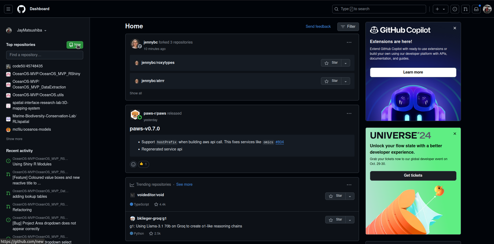
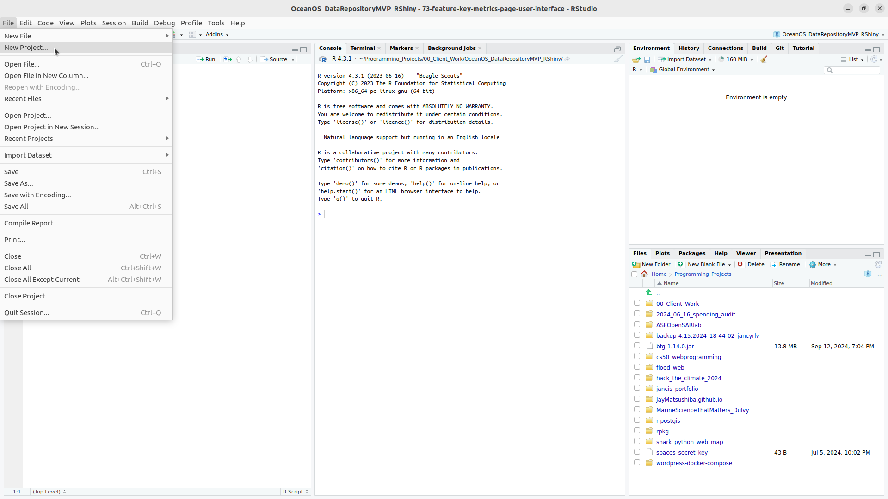
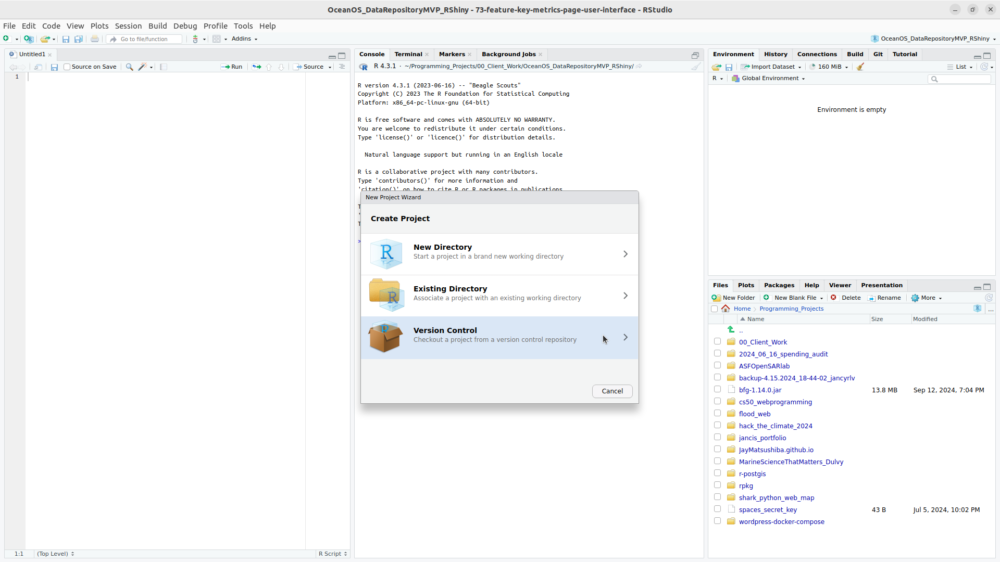
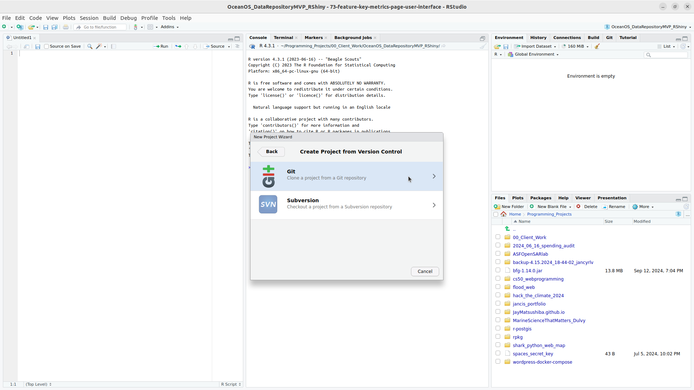
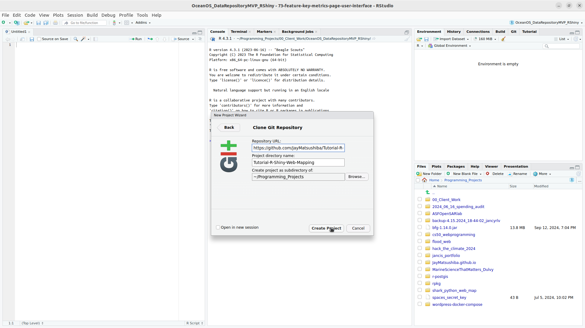

```{r setup, include=FALSE}
knitr::opts_chunk$set(echo = TRUE)
```

# Creating web maps with R Shiny

## Introduction
The goal for this workshop is to create a basic web mapping application, where you can display polygons and rasters on a basemap. This web map should be accessible to anyone with an internet connection via web browser, like Google Chrome or Mozilla Firefox. 

This workshop assumes you have a basic understanding of the following tools: 
- Git (GitHub)
- R programming and using RStudio 
- Spatial analyses in R using `sf` and `terra` packages 

The source code and examples for this workshop can be found here: https://github.com/JayMatsushiba/Tutorial-R-Shiny-Web-Mapping 

### Why web maps? 
Before we get into how to build a web mapping application, we should ask ourselves what are the advantages of building these in the first place. 

### Other resources that I found helpful for developing this workshop
Happy Git and GitHub for the useR by Jennifer Bryan 
https://happygitwithr.com/

Shiny Basics 
https://shiny.posit.co/r/getstarted/shiny-basics/lesson1/index.html

Mastering Shiny by Hadley Wickham
https://mastering-shiny.org/index.html 

Using Leaflet with Shiny 
https://rstudio.github.io/leaflet/articles/shiny.html

## Part 1: GitHub and R Project Setup 
While setting up a project to work with Git and GitHub may be an extra step, it is really useful and important for keeping our work organized and accessible. 

Using Git and GitHub in itself can be an entire workshop in itself, so we will keep it as brief and straightforward as possible here. The reason why we use Git and GitHub is for a number of reasons. Firstly, it provides a backup to your work in case something happens to your computer. Secondly, it makes it easier to share code and keep it updated, compared to emailing random files around. Thirdly, it provides many tools for collaboration and is the main reason why I use Git and GitHub as part of my workflow. 

You may be confused by the distinction between Git and GitHub. Git refers to the system of organizing code changes, while GitHub is a service that runs Git on the cloud (meaning over the internet on a different computer from your own). 

### Create new GitHub Repository
A repository in broad terms is a place that stores the code for a given project. We can think of it as a folder with some fancy features, including the ability to keep track of changes made to it over time. The easiest way to create a new GitHub repository is through their website (https://github.com/). Click on the link and follow the instructions to create an account if you don't have one already. 



You can name your repository whatever you want, but I suggest something that is descriptive for the project that you are working on. I will be using "Tutorial-R-Shiny-Web-Mapping"

### Install Git
Depending on your operating system (Windows, MacOS, Linux), installation instructions for git are different. 

See this link for installation recommendations by OS. 
https://happygitwithr.com/install-git 

### Create GitHub Personal Access Token
Okay, let's get started in RStudio! Open the RStudio IDE software. 

Running this line of code will open a link in your browser, leading you to create a GitHub Personal Access Token (PAT), which will be used for enabling access to the GitHub repository from RStudio. 
```{r create_github_token, eval=FALSE}
usethis::create_github_token()
```

Keep this window open, because we will need the token displayed at the top of the page for setting our credentials in RStudio. 

### Setting credentials 
We need to add our credentials to RStudio using the next command. Run this in your RStudio console and paste in the PAT from the web page in the previous step. 
```{r gitcreds_set, eval=FALSE}
gitcreds::gitcreds_set()
```

### Create new R Project that is linked to GitHub repository 
Now, you should be able to create a new R Project that is linked to the GitHub repository that you created earlier. 





You should now have a R Project set up that we can work in that is version controlled with GitHub. This means that we can save our progress while backing it up to GitHub, as well as rollback to different versions in case we break something along the way. There is a lot that Git and GitHub can do that can make your work more efficient and easier to share, but that would be outside of the scope of this particular workshop. The **Happy Git and GitHub for the useR** by Jennifer Bryan (https://happygitwithr.com/) is a really good resource for specifically using GitHub with RStudio, so consult that if you would like to learn more. 

### Make your first changes through `git commit` and `git push`
To show how GitHub works with RStudio, let's make our first .R file in our project. I usually prefer to create an `/R` folder and create a new R file in there. Let's call this new file `spatial.R`. 

**Extra Note:**
You can actually make a new file straight from the RStudio console or in your code by using the following function. Totally optional, but I just like doing this for larger projects that are more complicated. This way the file is created automatically in the right place. 
```{r}
usethis::use_r("spatial") # creates R/spatial.R in your project 
```

Let's put some content into this `R/spatial.R`. Copy and paste the following code into the file. Save the changes to your file. 
```{r}
# This will contain the spatial data analysis code for this workshop.
print("Hello World")
```

In the upper right window, there are a few tabs, including one that says "Git". Click that tab to open the view. 
1

Click the "Commit" button in the "Git" view. This will open a new window. Here, you can decide what changes to your repository to commit, meaning record those changes as a version of your repository. 

Check the box for `R` under "Staged". This means these selected changes will be part of the next commit. In the "Commit message" box, it is best practice to write a short description about what changes this commit contains. Then, you can click the "Commit" button. After the commit, `R` should disappear as one of the files listed in the table. To back these changes up onto GitHub, we need to click the "Push" button with the upwards facing green arrow. 

Now, if you check back to your GitHub page through your browser, you should be able to see these changes there! That means your Github and RStudio have been set up successfully. You should be repeating this "git commit" and "git push" operation throughout your work as best practice. 

**Important Note:**
GitHub has a maximum individual file size of 100 MB, and will not allow uploads for files larger than this. However, git will still allow you to commit additions and changes to large files like this (since this is a GitHub limitation rather than for git). It can be quite a hassle to fix if you accidentally commit a large file, so make sure you do not do this. Simply deleting the large files will not fix the problem, since the large files become part of the repository's versions after being committed. 

Addressing these problems are beyond this workshop, but see here for additional context: 
https://stackoverflow.com/questions/2100907/how-can-i-remove-delete-a-large-file-from-the-commit-history-in-the-git-reposito 

## Part 2: Basic Spatial Analysis with `sf` and `terra`
Let's get started on working with spatial data in R! We will continue to work out of `R/spatial.R`, which should look like this at this point after being committed and pushed to GitHub in the previous step:
```{r}
# This will contain the spatial data analysis code for this workshop.
print("Hello World")
```

Let's remove the `print("Hello World")` and load the relevant packages. Install the packages if you haven't done that yet. 
```{r}
# This will contain the spatial data analysis code for this workshop.
library(sf)
library(terra)
library(tidyverse)
```

We need some spatial data! I have a folder of sample data hosted on GitHub that you can download here: 
https://github.com/JayMatsushiba/Tutorial-R-Shiny-Web-Mapping.git. You can download the files individually in the `data` folder, or you can `git clone` the whole repository (which includes a sample Spatial Shiny App). The process for cloning the repository is actually the same as linking to a new project, so follow the steps in the **Create new R Project that is linked to GitHub repository** section again, just with the link to my repo instead. Copy the `data` folder from my repository into your own project. 

Common file formats for spatial data include shapefiles (.shp with associated files), .geojson, .geotiff, etc. (there are so many...). Generally though, we can read in vector spatial data with `st_read("filepath_here")` and raster data with `rast("filepath_here")`. 

### Let's try reading some spatial files into R:
```{r}
# These are iNaturalist observations of the American Black Bear in British Columbia
# This is an example of a point data.
black_bear_observations_bc <- st_read("data/black_bear_observations_bc/black_bear_observations_bc.shp")

# This is a polygon representing the boundaries of Burnaby
# https://data.burnaby.ca/datasets/d903b87782734451ae286cb0b59938ac
burnaby <- st_read("data/Burnaby_Boundary/Burnaby_Boundary.shp")

# This is a multipolygon representing British Columbia
# https://open.canada.ca/data/en/dataset/a883eb14-0c0e-45c4-b8c4-b54c4a819edb 
british_columbia <- st_read("data/british_columbia/british_columbia.shp")
```

### Let's try doing some basic plots 


## Part 3: Basic Shiny Apps

## Part 4: Spatial Data and Shiny Apps 

## Part 5: Publishing Your Shiny Apps 
